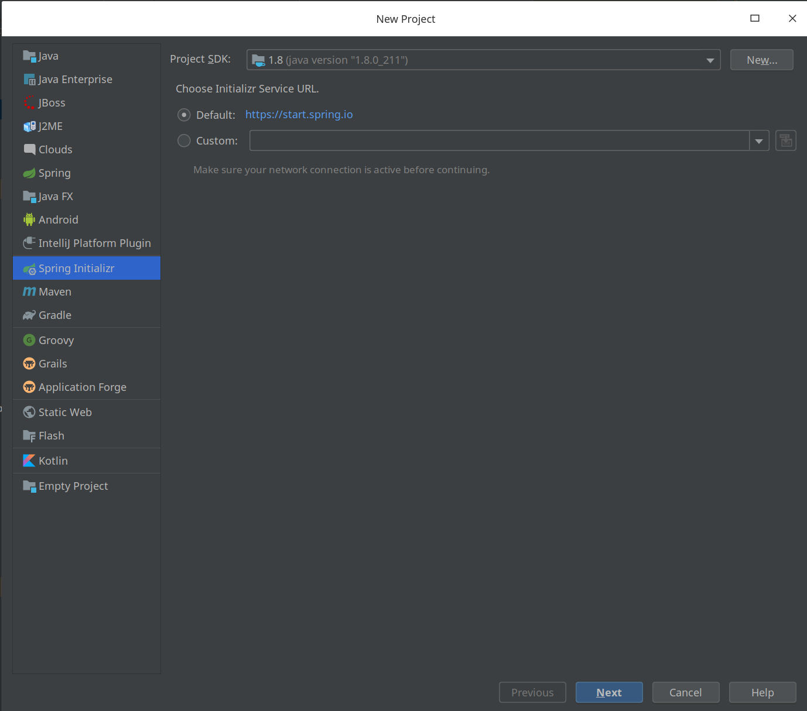
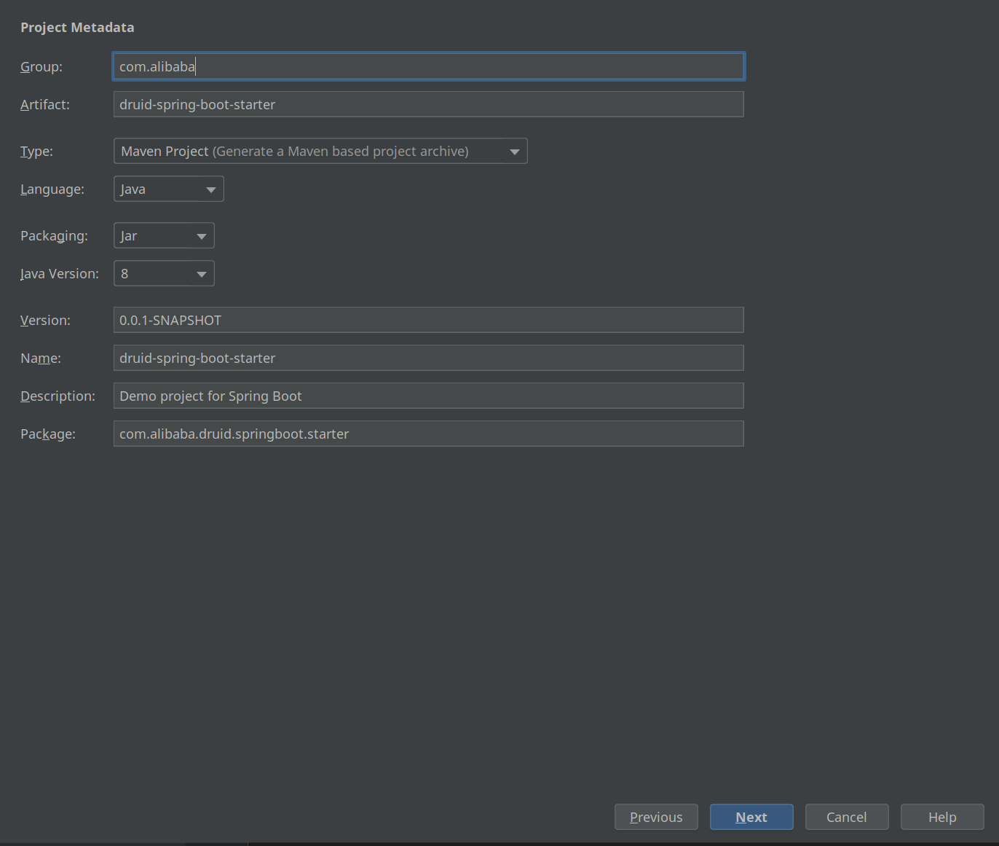
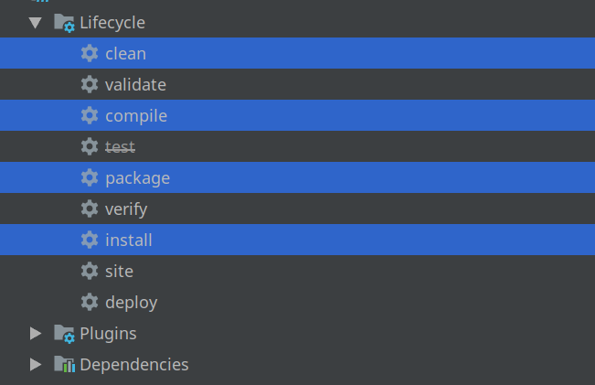

---
layout:	post
title:  2分钟创建属于你自己的 spring boot starter
copyright: true
date: 2019-07-07 01:00:28
subtitle:   "原创"
tags:
	- JAVA
---

Spring boot 的核心特性就是自动装配。 有时候在项目中需要重复集成某个框架， 但是spring boot 官方并没有帮我们集成stater，为了减少代码的重复编写。 今天我们就来编写一个自定义的 spring boot stater。

简单的说一下 spring boot stater 的自动装配原理

1. 通过  XXAutoCOnfiguration 加载 spring boot 的bean。 可以通过一些 ConditionOn** 之类的注解，根据条件判断是否装配Bean。

2. 在 classpath 目录下面的 META-INF/spring.factories 文件里面写上要装配的Class 位置,比如

   ```
   org.springframework.boot.autoconfigure.EnableAutoConfiguration=\
   com.alibaba.druid.springbootstater.autoconfiguration.DruidAutoConfiguration
   ```


我们以 alibaba 的Druid 连接池子为例：

1.  我们在 IDEA 创建一个 Spring boot项目， 可以通过 spring boot initializr 来创建项目。如图所示





点击next 然后进入项目。

在 pom.xml 文件中引入 

```xml
 <properties>
        <java.version>1.8</java.version>
        <druid.version>1.1.13</druid.version>
    </properties>

    <dependencies>
        <dependency>
            <groupId>com.alibaba</groupId>
            <artifactId>druid</artifactId>
            <version>${druid.version}</version>
        </dependency>
        <dependency>
            <groupId>org.springframework.boot</groupId>
            <artifactId>spring-boot-starter</artifactId>
        </dependency>
        <dependency>
            <groupId>org.springframework.boot</groupId>
            <artifactId>spring-boot-starter-web</artifactId>
        </dependency>
        <dependency>
            <groupId>org.springframework.boot</groupId>
            <artifactId>spring-boot-configuration-processor</artifactId>
            <optional>true</optional>
        </dependency>
    </dependencies>
```

> ​	pom 文件引入解释

- 需要引入 `spring-boot-starter` 包
- 引入 `spring-boot-starter-web`  方便引入 Druid DashBoard，和加入 SQL 监控等功能。
- `spring-boot-configuration-processor`  解析配置。
- 引入要自动装配的框架 druid


2.  在目录下面创建一个 config包， 然后再创建一个 DruidAutoConfiguration 的类

 

```java
import com.alibaba.druid.pool.DruidDataSource;
import org.springframework.boot.autoconfigure.condition.ConditionalOnClass;
import org.springframework.boot.autoconfigure.condition.ConditionalOnMissingBean;
import org.springframework.boot.context.properties.ConfigurationProperties;
import org.springframework.context.annotation.Bean;
import org.springframework.context.annotation.Configuration;

import javax.sql.DataSource;

@Configuration // 申明这是一个配置类

public class DruidAutoConfiguration {

    @Bean
    @ConfigurationProperties(prefix = "spring.datasource") 
    // 给 DruidDatSource 引入配置
    @ConditionalOnClass(DruidDataSource.class) 
    // class path 下面必须存在 DruidDataSource 才加载这个Bean
    @ConditionalOnMissingBean(DataSource.class) 
    // Spring 容器中缺少DataSource 这个Bean 才加载
    public DataSource dataSource() {
        return new DruidDataSource();
    }
}
```

3.  在 resource 目录下面 创建 `META-INF` 文件夹， 然后在 `META-INF` 文件夹下面创建 `spring.factories`

   

   ```
   org.springframework.boot.autoconfigure.EnableAutoConfiguration=\
   com.alibaba.druid.springboot.starter.config.DruidAutoConfiguration
   ```

   注意上面的value 是填写你的装配类的项目位置。


4. 将项目打包到你的本地 maven 仓库

   

然后在你的要使用Druid的项目中引入

```xml
<dependency>
    <groupId>com.alibaba</groupId>
    <artifactId>druid-spring-boot-starter</artifactId>
    <version>0.0.1-SNAPSHOT</version>
</dependency>
```

然后在你的 application.properties 文件中填写你的配置如下

```properties

spring.datasource.username=root ## 数据库账户名
spring.datasource.password=111111 ## 数据库密码
spring.datasource.driver-class-name=com.mysql.cj.jdbc.Driver ## 数据库驱动
spring.datasource.url=jdbc:mysql://127.0.0.1:3307/jdbc ## 数据库地址
spring.datasource.type=com.alibaba.druid.pool.DruidDataSource
spring.datasource.initialSize=5
spring.datasource.minIdle=5
spring.datasource.maxActive=20
spring.datasource.maxWait=60000
spring.datasource.timeBetweenEvictionRunsMillis=60000
spring.datasource.minEvictableIdleTimeMillis=300000
spring.datasource.testWhileIdle=true
spring.datasource.testOnBorrow=false
spring.datasource.testOnReturn=false
spring.datasource.poolPreparedStatements=true
spring.datasource.filters=stat,wall,log4j
spring.datasource.maxPoolPreparedStatementPerConnectionSize=20
spring.datasource.useGlobalDataSourceStat=true
spring.datasource.connectionProperties=druid.stat.mergeSql=true;druid.stat.slowSqlMillis=500
spring.datasource.initialization-mode=always
```

然后启动你的项目， 这个时候， spring boot 已经自动帮你装配了Druid。

不仅如此还可以 增加 Druid 的 SQL 监控， 和开启 Druid DashBoard等。

> ​	该项目Github地址： [项目地址](https://github.com/jeesk/druid-spring-boot-starter)