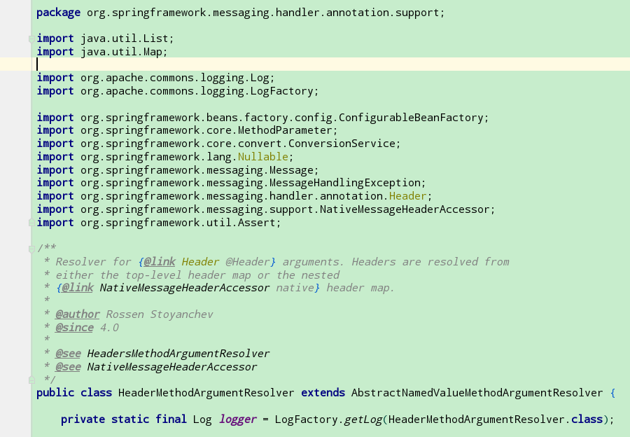
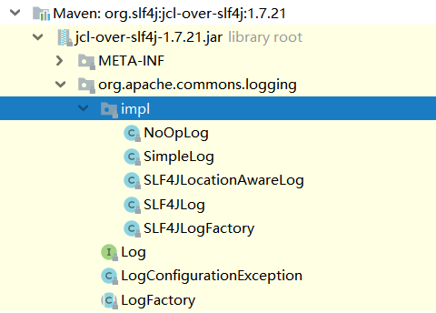
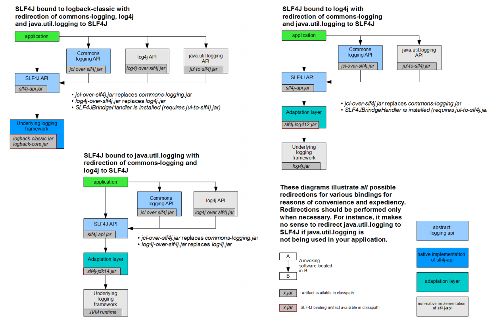

在 `阿里Java 开发强制规范` 中的第二章中的日志规约中的第一条讲到

```
1.【强制】应用中不可直接使用日志系统（Log4j、Logback）中的API，而应依赖使用日志框架SLF4J中的API，使用门面模式的日志框架，有利于维护和各个类的日志处理方式统一。
```

这里提到了日志门面,那么就有日志实现, 列举一下常见的日志系统

|                              |                         |
| ---------------------------- | ----------------------- |
| 日志门面                     | 日志实现                |
| JCL (Jakarta common Logging) | JUL (Java Util Logging) |
| Slf4j                        | Logback                 |
| Jboss Logging                | Log4j2                  |
|                              |                         |

既然 Slf4j  备受推荐, 如何使用  Slf4j 呢 ?


###	1.	如何使用Slf4j

> ​	通过 slf4j 官方文档的一张图, 我们简单认识一下 如何将 Slf4j 和相关的日志具体实现进行绑定.
>
> ​    (继承抽象层, 但是具体实现由各个日志框架实现.)
>


1.  没有任何绑定, 那么 输出为null.

   ```
   只要 slf4j-api.jar
   ```

   

2. logback-classic. jar 作为 Slf4j 的具体实现   依赖于logback-classic.jar , logback-core.jar, 并且  logback 实现了slf4j, 所以不需要桥接器.

   ```
   slf4j-api.jar  API抽象层
   logback-classic.jar  logback 实现了slf4j-api
   logback-core.jar     logback的核心包
   ```

   

3. 将 Slf4j 绑定到 log4j,  需要桥接器  slf4j-log412.jar , 然后再引入 log4j.jar.  首先说明一下, log4j 并没有实现 slf4j 的API, 那么要将 log4j 和slf4j 绑定在一起, 必须使用桥接器, 才能使用 log4j 看作 Slf4j 的具体的实现 .

   ```
   slf4j-api.jar  API抽象层
   slf4j-log412.jar    slf4j到log4j的桥梁, 将 jul 封装成 slf4j, 然后绑定到Slf4j.
   log4j.jar     日志具体实现
   ```

   

4. SLF4J 绑定到 jul, 需要 slf4j-api.jar , slf4j-jdk14.jar , 依赖于 jVM环境的jul 包.

   ```
   slf4j-api.jar  API抽象层
   slf4j-jdk14.jar	  将 Jul 封装车成 Slf4j, 然后绑定到 Slf4j.
   JVM环境
   ```

5. 将 Slf4j 绑定到 slf4j-simple , 因为 slf4j-simple 实现了 SLf4j的APi , 那么需要的包就是.

   ```
   slf4j-api.jar  API抽象层
   slf4j-simple.jar 具体实现
   ```

6. SLF4j 绑定到 没有任何操作

   ```
   slf4j-api.jar  API抽象层
   slf4j-nop.jar  具体实现
   ```

总结:  日志实现分为两种 

1. ​	实现了  Slf4j-api的日志框架, 这种框架在项目中需要对应的桥接器, 和具体日志实现的jar即可.
2.    ​    没有实现 Slf4j 的日志框架, 如果要使用Slf4j-APi ,需要桥接器将两者绑定,才能使用.

日志包相关分类:

- log4j1:

  - log4j：log4j1的全部内容

- log4j2:

  - log4j-api:log4j2定义的API
  - log4j-core:log4j2上述API的实现

- logback:

  - logback-core:logback的核心包
  - logback-classic：logback实现了slf4j的API

- commons-logging:

  - commons-logging:commons-logging的原生全部内容
  - log4j-jcl:commons-logging到log4j2的桥梁
  - jcl-over-slf4j：commons-logging到slf4j的桥梁

- slf4j转向某个实际的日志框架: 

  场景介绍：如 使用slf4j的API进行编程，底层想使用log4j1来进行实际的日志输出，这就是slf4j-log4j12干的事。同理来说, 将自己委托给绑定到 Slf4j, 由自己来打印日志. 

  - slf4j-jdk14：slf4j到jdk-logging的桥梁
  - slf4j-log4j12：slf4j到log4j1的桥梁
  - log4j-slf4j-impl：slf4j到log4j2的桥梁
  - logback-classic：slf4j到logback的桥梁
  - slf4j-jcl：slf4j到commons-logging的桥梁

  某个实际的日志框架转向slf4j：

  场景介绍：如 使用log4j1的API进行编程，但是想最终通过logback来进行输出，所以就需要先将log4j1的日志输出转交给slf4j来输出，slf4j再交给logback来输出。将log4j1的输出转给slf4j，这就是log4j-over-slf4j做的事

  这一部分主要用来进行实际的日志框架之间的切换（下文会详细讲解）

  - jul-to-slf4j：jdk-logging到slf4j的桥梁

  - log4j-over-slf4j：log4j1到slf4j的桥梁

  - jcl-over-slf4j：commons-logging到slf4j的桥梁. 

    上面的是因为没有实现 Slf4j,  所以要想将 上面的日志打印权利交给 Slf4j.

###	2.	如何统一日志门面

​	日志门面可以简单的理解为抽象的日志API.   那么看看我们常用的一些框架使用的日志, 比如Spring 框架使用的日志门面就是 JCL , 随着时间的变迁, JCL 也是过时了, 新起之秀 Spring boot 使用的日志门面则是  Slf4j.

spring boot 和 spring framework的日志门面不同, 如何处理




> spring boot 官方文档介绍
>
> Spring Boot uses [Commons Logging](https://commons.apache.org/logging) for all internal logging but leaves the underlying log implementation open. Default configurations are provided for [Java Util Logging](https://docs.oracle.com/javase/8/docs/api//java/util/logging/package-summary.html), [Log4J2](https://logging.apache.org/log4j/2.x/), and [Logback](https://logback.qos.ch/). In each case, loggers are pre-configured to use console output with optional file output also available.
>
> By default, if you use the “Starters”, Logback is used for logging. Appropriate Logback routing is also included to ensure that dependent libraries that use Java Util Logging, Commons Logging, Log4J, or SLF4J all work correctly.
>
> 引用于: <https://docs.spring.io/spring-boot/docs/2.2.0.BUILD-SNAPSHOT/reference/html/#boot-features-logging>

我们找到 spring boot 的pom 文件依赖,会发现 spring boot 使用的 日志的starter

```xml 
<dependency>
	<groupId>org.springframework.boot</groupId>
	<artifactId>spring-boot-starter-logging</artifactId>
</dependency>
```

点击  `spring-boot-starter-logging`, 会发现这些依赖.

```
<dependencies>
		<dependency>
			<groupId>ch.qos.logback</groupId>
			<artifactId>logback-classic</artifactId>
		</dependency>
		<dependency>
			<groupId>org.slf4j</groupId>
			<artifactId>jcl-over-slf4j</artifactId>
		</dependency>
		<dependency>
			<groupId>org.slf4j</groupId>
			<artifactId>jul-to-slf4j</artifactId>
		</dependency>
		<dependency>
			<groupId>org.slf4j</groupId>
			<artifactId>log4j-over-slf4j</artifactId>
		</dependency>
	</dependencies>
```

> ​	这个时候你还是发现, 只要是使用了  spring boot 的starters , 那么默认使用的就是  slf4j + logback.

####	问题 1:   spring boot 依赖于 spring framework , 两者使用的日志框架并不统一? 怎么解决这个问题呢?

我们看看spring boot 是如何做的

```xml 
<?xml version="1.0" encoding="UTF-8"?>
<project xmlns="http://maven.apache.org/POM/4.0.0" xmlns:xsi="http://www.w3.org/2001/XMLSchema-instance" xsi:schemaLocation="http://maven.apache.org/POM/4.0.0 http://maven.apache.org/xsd/maven-4.0.0.xsd">
	<modelVersion>4.0.0</modelVersion>
	<parent>
		<groupId>org.springframework.boot</groupId>
		<artifactId>spring-boot-starters</artifactId>
		<version>1.4.2.RELEASE</version>
	</parent>
	<artifactId>spring-boot-starter</artifactId>
	<name>Spring Boot Starter</name>
	<description>Core starter, including auto-configuration support, logging and YAML</description>
	<url>http://projects.spring.io/spring-boot/</url>
	<organization>
		<name>Pivotal Software, Inc.</name>
		<url>http://www.spring.io</url>
	</organization>
	<properties>
		<main.basedir>${basedir}/../..</main.basedir>
	</properties>
	<dependencies>
		<dependency>
			<groupId>org.springframework.boot</groupId>
			<artifactId>spring-boot</artifactId>
		</dependency>
		<dependency>
			<groupId>org.springframework.boot</groupId>
			<artifactId>spring-boot-autoconfigure</artifactId>
		</dependency>
		<dependency>
			<groupId>org.springframework.boot</groupId>
			<artifactId>spring-boot-starter-logging</artifactId>
		</dependency>
		<dependency>
			<groupId>org.springframework</groupId>
			<artifactId>spring-core</artifactId>
			<exclusions>
				<exclusion>
					<groupId>commons-logging</groupId>
					<artifactId>commons-logging</artifactId>
				</exclusion>
			</exclusions>
		</dependency>
		<dependency>
			<groupId>org.yaml</groupId>
			<artifactId>snakeyaml</artifactId>
			<scope>runtime</scope>
		</dependency>
	</dependencies>
</project>

```

1. 

   既然官方的的 jcl 包,被排除了,那么引入的第三方包 就是用来代替的 官方的jcl.

   并且包名还必须和官方包是一样, 不然找不到class文件, 会无法启动.

   img

如图所示,  将 apache 的common-logging 狸猫换太子.  我们来看看 Log的具体实现. SLF4JLog, 代码有缩减

```java
import org.apache.commons.logging.Log;
import org.slf4j.Logger;
import org.slf4j.LoggerFactory;
public class SLF4JLog implements Log, Serializable {


    private transient Logger logger;

    SLF4JLog(Logger logger) {
        this.logger = logger;
        this.name = logger.getName();
    }
       protected Object readResolve() throws ObjectStreamException {
        Logger logger = LoggerFactory.getLogger(this.name);
        return new SLF4JLog(logger);
}
    }
```

当spring 框架调用  Log.info() 的时候,  实际是使用桥接的方式调用的  Slf4j的具体的实现类经过包装后再调用日志打印.   使用上面的方法完美解决了框架建日志系统不一致的问题. 这就是使用门面系统API 的好处, 门面系统是顶级API, 并且封装了很多日志框架的桥接器, 使用排除包和换包的方式,将原来使用的日志调用, 替换到了 Slf4j的实现类.

```
<dependencies>
		<dependency>
			<groupId>ch.qos.logback</groupId>
			<artifactId>logback-classic</artifactId>
		</dependency>
		<dependency>
			<groupId>org.slf4j</groupId>
			<artifactId>jcl-over-slf4j</artifactId>
		</dependency>
		<dependency>
			<groupId>org.slf4j</groupId>
			<artifactId>jul-to-slf4j</artifactId>
		</dependency>
		<dependency>
			<groupId>org.slf4j</groupId>
			<artifactId>log4j-over-slf4j</artifactId>
		</dependency>
		// 上面3 个依赖都是维持 jcl, jul, log4j 的编程方式, 但是都将日志的输出交给Slf4j 的实现. 
	</dependencies>
```


log4j-over-slf4j 这个库定义了与log4j一致的接口（包名、类名、方法签名均一致），但是接口的实现却是对slf4j日志接口的包装，即间接调用了slf4j日志接口，实现了对日志的转发。同理,   jcl-over-slf4j 也是一样的道理.  

下面看看 jcl -over-slf4j 的原理, 在包里找到 Logger

```java
@SuppressWarnings("rawtypes")
public class Logger extends Category {
    public void trace(Object message, Throwable t) {
        differentiatedLog(null, LOGGER_FQCN, LocationAwareLogger.TRACE_INT, message, null);
    }

}

在 调用trace 方法的时候, 使用differentiatedLog 方法进行了转发. 下面是方法的具体实现.

package org.apache.log4j;

import org.apache.log4j.helpers.NullEnumeration;
import org.slf4j.LoggerFactory;
import org.slf4j.Marker;
import org.slf4j.MarkerFactory;
import org.slf4j.spi.LocationAwareLogger;

import java.util.Enumeration;

@SuppressWarnings("rawtypes")
public class Category {

    private static final String CATEGORY_FQCN = Category.class.getName();

    private String name;

    protected org.slf4j.Logger slf4jLogger;
    private org.slf4j.spi.LocationAwareLogger locationAwareLogger;

    private static Marker FATAL_MARKER = MarkerFactory.getMarker("FATAL");

    Category(String name) {
        this.name = name;
        slf4jLogger = LoggerFactory.getLogger(name);
        if (slf4jLogger instanceof LocationAwareLogger) {
            locationAwareLogger = (LocationAwareLogger) slf4jLogger;
        }
    }

    public static Category getInstance(Class clazz) {
        return Log4jLoggerFactory.getLogger(clazz.getName());
    }

    public static Category getInstance(String name) {
        return Log4jLoggerFactory.getLogger(name);
    }

    public final Category getParent() {
        return null;
    }

   
   // 调用日志打印的方法的时候,  首先是用Slf4j 的LoggerFactroy 获得logger, 然后调用debug 方法, 自然而然将日志的输出权利交给了 Slf4j.
    void differentiatedLog(Marker marker, String fqcn, int level, Object message, Throwable t) {

        String m = convertToString(message);
        if (locationAwareLogger != null) {
            locationAwareLogger.log(marker, fqcn, level, m, null, t);
        } else {
            switch (level) {
            case LocationAwareLogger.TRACE_INT:
                slf4jLogger.trace(marker, m);
                break;
            case LocationAwareLogger.DEBUG_INT:
                slf4jLogger.debug(marker, m);
                break;
            case LocationAwareLogger.INFO_INT:
                slf4jLogger.info(marker, m);
                break;
            case LocationAwareLogger.WARN_INT:
                slf4jLogger.warn(marker, m);
                break;
            case LocationAwareLogger.ERROR_INT:
                slf4jLogger.error(marker, m);
                break;
            }
        }
    }

	
    public void debug(Object message) {
        differentiatedLog(null, CATEGORY_FQCN, LocationAwareLogger.DEBUG_INT, message, null);
    }

    public void info(Object message) {
        differentiatedLog(null, CATEGORY_FQCN, LocationAwareLogger.INFO_INT, message, null);
    }

    public void warn(Object message) {
        differentiatedLog(null, CATEGORY_FQCN, LocationAwareLogger.WARN_INT, message, null);
    }


    public void error(Object message) {
        differentiatedLog(null, CATEGORY_FQCN, LocationAwareLogger.ERROR_INT, message, null);
    }


    public void log(Priority p, Object message, Throwable t) {
        int levelInt = priorityToLevelInt(p);
        differentiatedLog(null, CATEGORY_FQCN, levelInt, message, t);
    }


}

```


但是 jul-to-slf4j 确实一个奇葩, 因为 是 jdk自带的的包, 所以不可能排除掉. 那么只能通过handler机制, root logger上install一个handler，将所有日志**劫持**到slf4j上。要使得jul-to-slf4j生效，需要执行下面的代码.

```
 SLF4JBridgeHandler.removeHandlersForRootLogger();
 SLF4JBridgeHandler.install();
```

spring boot 和spring framework 统一抽象层就是一个很好的例子, 也是解决项目中日志门面不同的号方法. 不仅如此.

> ​	统一日志门面总结如下: 

1.   排除日志门面的jar.
2.   替换原日志门面. 使用桥接器
3.    导入 日志系统的具体实现, 如果实现了 Slf4j-Api, 不需要桥接器.   相反, 对应的日志系统和Slf4j 一起工作, 需要对应的桥接器(to 相关的jar).


### 3. 混合日志框架,如何统一输出.

如果你使用的框架 A 使用了 log4j ,B 使用 log4j2 , C 使用了 jul , 在不改变原有代码之前那么如何统一给 一个日志系统的实现呢? 



1. 使用 Slf4j + Logback的输出代替项目中的  Commons Logging Api, log4j, 以及 jul.

   首先 使用 jcl-over-slf4j 替换 common logging api. 

    然后使用 log4j-over-slf4j 替换 log4j.jar (将 log4j 适配成 Slf4j 的实现)

    使用 jul-to-slf4j.  桥接器 桥接 slf4j. 

    加入 logback.jar

2.  使用 Slf4j + log4j 代替项目中 的 common logging + jul

    首先使用 jcl-over-slf4j.jar 替换 commons-loggins.jar

    然后使用  jul-to-slf4j.jar 桥接 jul 和Slf4j,

    引入 slf4j-log4j12, 将slf4j的具体实现交给 log4j,

    最后加入 log4j.jar 

    

3.  slf4j + jul .

    使用 jcl-over-slf4j.jar  将日志抽象层更换成 Slf4j.

    使用  log4j  -over-slf4j替换掉 log4j.jar ,  将log4j 适配到 slf4j.

    加入 slf4j-jdk14.jar  将 slf4j 的日志输出交给 jdk-logging 来输出.

> **上面的原理都是, 将日志抽象层更换成统一的 Slf4j, 然后将 Slf4j 的具体实现移交移交给某一个日志框架.** 

常见的一些冲突:

 jcl-over-slf4j 与 slf4j-jcl 冲突

- jcl-over-slf4j： commons-logging切换到slf4j
- slf4j-jcl : slf4j切换到commons-logging

如果这两者共存的话，必然造成相互委托，造成内存溢出

 log4j-over-slf4j 与 slf4j-log4j12 冲突

- log4j-over-slf4j ： log4j1切换到slf4j
- slf4j-log4j12 : slf4j切换到log4j1

如果这两者共存的话，必然造成相互委托，造成内存溢出。

即判断slf4j-log4j12 jar包中的org.slf4j.impl.Log4jLoggerFactory是否存在，如果存在则表示冲突了，抛出异常提示用户要去掉对应的jar包，代码如下，在slf4j-log4j12 jar包的org.apache.log4j.Log4jLoggerFactory中：

 jul-to-slf4j 与 slf4j-jdk14 冲突

- jul-to-slf4j ： jdk-logging切换到slf4j
- slf4j-jdk14 : slf4j切换到jdk-logging


>
>
>1. [Slf4j 官方文档](https://www.slf4j.org/docs.html)
>
>